# 📊 ERD — 리팩토링 스키마 (claude/refactor-db-schema-Viv3D)

> 한국형 엔터프라이즈 표준 (T 접두사, 대문자, INT AUTO_INCREMENT PK, 분류어 종결, 감사 컬럼) 적용 후의 19개 테이블 관계도.
>
> 모든 테이블은 공통으로 감사 컬럼 4종을 포함합니다 — 본 ERD 에서는 시각적 혼잡도를 낮추기 위해 생략했습니다:
> ```
> INS_ID INT, INS_DTM TIMESTAMP, MOD_ID INT, MOD_DTM TIMESTAMP
> ```

---

## 도메인별 분류

| 도메인 | 테이블 |
|---|---|
| **회사 레퍼런스** | `TCOMPANY_TYPE`, `TCOMPANY`, `TCOMPANY_ALIAS`, `TCOMPANY_BENEFIT`, `TBENEFIT_PRESET` |
| **프로파일러·직무** | `TPROFILE`, `TPROFILE_JOB_FIT`, `TJOB_GROUP`, `TJOB`, `TPROFILER_QUESTION`, `TQUESTION_SCENARIO` |
| **회원·인증** | `TMEMBER`, `TSOCIAL_ACCOUNT`, `TEMAIL_VERIFICATION` |
| **사용자 활동** | `TPROFILER_RESULT`, `TCOMPARISON` |
| **랜딩·통계** | `TCOMPARISON_FEED`, `TDAILY_STAT`, `TPOPULAR_CASE` |

---

## 전체 ERD

```mermaid
erDiagram

    %% ━━━━━━━━━━ 회사 레퍼런스 ━━━━━━━━━━
    TCOMPANY_TYPE ||--o{ TCOMPANY          : classifies
    TCOMPANY_TYPE ||--o{ TBENEFIT_PRESET   : presets
    TCOMPANY      ||--o{ TCOMPANY_ALIAS    : aliased_by
    TCOMPANY      ||--o{ TCOMPANY_BENEFIT  : provides

    %% ━━━━━━━━━━ 프로파일러·직무 ━━━━━━━━━━
    TPROFILE            ||--o{ TPROFILE_JOB_FIT   : has_fit
    TJOB_GROUP          ||--o{ TJOB               : contains
    TPROFILER_QUESTION  ||--o{ TQUESTION_SCENARIO : has_scenario

    %% ━━━━━━━━━━ 회원 ━━━━━━━━━━
    TMEMBER ||--o{ TSOCIAL_ACCOUNT     : links
    TMEMBER ||--o{ TEMAIL_VERIFICATION : verifies
    TMEMBER ||--o{ TPROFILER_RESULT    : takes
    TMEMBER ||--o{ TCOMPARISON         : creates

    %% ━━━━━━━━━━ 결과·비교 (크로스 도메인) ━━━━━━━━━━
    TJOB     ||--o{ TPROFILER_RESULT : selected_in
    TPROFILE ||--o{ TPROFILER_RESULT : matched_to

    %% ━━━━━━━━━━ 랜딩·통계 ━━━━━━━━━━
    TCOMPARISON ||--o{ TCOMPARISON_FEED : fed_as

    %% ━━━━━━━━━━ 엔티티 정의 ━━━━━━━━━━

    TCOMPANY_TYPE {
        int     COMP_TP_ID         PK "AI, PK"
        varchar COMP_TP_CD         UK "코드: large/startup/mid/foreign/public/freelance"
        varchar COMP_TP_NM         "표시명: 대기업, 스타트업 등"
        decimal GROWTH_RATE_VAL    "연봉 상승률 (0.0350=3.5%)"
        varchar GROWTH_LABEL_NM    "성장률 설명"
        tinyint STABILITY_SCORE_NO "고용 안정성 (1~100)"
    }

    TCOMPANY {
        int     COMP_ID             PK "AI, PK"
        varchar COMP_ENG_NM         UK "영문 식별명 (cj, samsung_elec …)"
        varchar COMP_NM             UK "정식 명칭"
        int     COMP_TP_ID          FK "TCOMPANY_TYPE"
        varchar INDUSTRY_NM         "산업 분류"
        varchar LOGO_NM             "로고 약어"
        json    WORK_STYLE_VAL      "근무 형태 JSON"
        varchar CAREERS_BENEFIT_URL "채용/복지 URL"
    }

    TCOMPANY_ALIAS {
        int     ALIAS_ID PK "AI, PK"
        int     COMP_ID  FK "TCOMPANY"
        varchar ALIAS_NM    "검색용 별칭"
    }

    TCOMPANY_BENEFIT {
        int      BENEFIT_ID      PK "AI, PK"
        int      COMP_ID         FK "TCOMPANY"
        varchar  BENEFIT_CD         "복지 코드 (meal, housing …)"
        varchar  BENEFIT_NM         "복지 표시명"
        int      BENEFIT_AMT        "연간 환산 (만원)"
        varchar  BENEFIT_CTGR_CD    "카테고리 (financial, work_env …)"
        varchar  BADGE_CD           "신뢰도 (est/official)"
        varchar  NOTE_CTNT          "상세 설명"
        bool     QUAL_YN            "정성적 여부"
        varchar  QUAL_DESC_CTNT     "정성적 상세"
        smallint SORT_ORDER_NO      "정렬 순서"
    }

    TBENEFIT_PRESET {
        int      PRESET_ID          PK "AI, PK"
        int      COMP_TP_ID         FK "TCOMPANY_TYPE"
        varchar  BENEFIT_CD
        varchar  BENEFIT_NM
        int      BENEFIT_AMT
        varchar  BENEFIT_CTGR_CD
        varchar  BADGE_CD
        bool     DEFAULT_CHECKED_YN "기본 체크 여부"
        smallint SORT_ORDER_NO
    }

    TPROFILE {
        int     PROFILE_ID        PK "AI, PK"
        varchar PROFILE_CD        UK "코드 (balanced, growth_seeker …)"
        varchar PROFILE_NM          "표시명 (균형파, 성장파 …)"
        text    PROFILE_DESC_CTNT
        varchar MAP_PRIORITY_CD     "우선순위 키 (salary/wlb/benefits/brand)"
        json    VEC_VAL             "6차원 벡터"
    }

    TPROFILE_JOB_FIT {
        int     FIT_ID      PK "AI, PK"
        int     PROFILE_ID  FK "TPROFILE"
        varchar SCENARIO_CD    "tech/design/pm/biz …"
        text    FIT_CTNT       "적합한 점"
        text    CAUTION_CTNT   "주의할 점"
    }

    TJOB_GROUP {
        int     JOB_GROUP_ID  PK "AI, PK"
        varchar JOB_GROUP_NM     "그룹명 (개발/디자인 …)"
        varchar COLOR_CD         "UI 색상"
        tinyint SORT_ORDER_NO
    }

    TJOB {
        int     JOB_ID        PK "AI, PK"
        varchar JOB_CD        UK "직무 코드 (fe_dev, pm …)"
        int     JOB_GROUP_ID  FK "TJOB_GROUP"
        varchar JOB_NM           "직무 표시명"
        varchar ICON_NM          "아이콘 이모지"
        varchar SCENARIO_CD      "시나리오 매핑"
        tinyint SORT_ORDER_NO
    }

    TPROFILER_QUESTION {
        int     QUESTION_ID       PK "AI, PK"
        int     QUESTION_NO       UK "원본 번호 (1..N)"
        varchar QUESTION_LABEL_NM
        varchar OPTION_A_TITLE_NM
        json    OPTION_A_FX_VAL   "A 선택지 점수"
        varchar OPTION_B_TITLE_NM
        json    OPTION_B_FX_VAL   "B 선택지 점수"
    }

    TQUESTION_SCENARIO {
        int     QUESTION_SCENARIO_ID PK "AI, PK"
        int     QUESTION_ID          FK "TPROFILER_QUESTION"
        varchar SCENARIO_CD
        text    DESC_A_CTNT
        text    DESC_B_CTNT
    }

    TMEMBER {
        int     MBR_ID                PK "AI, PK"
        varchar EMAIL_ADDR            UK "로그인 ID"
        varchar PWD_HASH_VAL          "bcrypt (소셜 시 NULL)"
        varchar MBR_NM                "표시 이름"
        varchar JOB_NM                "선택 직군명"
        varchar ROLE_CD               "user/admin"
        varchar LOGIN_PROVIDER_CD     "local/kakao/naver/google"
        varchar COMP_EMAIL_ADDR       "회사 이메일"
        varchar COMP_EMAIL_VRFC_YN    "회사 이메일 인증 여부"
    }

    TSOCIAL_ACCOUNT {
        int     SOCIAL_ID        PK "AI, PK"
        int     MBR_ID           FK "TMEMBER"
        varchar PROVIDER_CD         "kakao/naver/google"
        varchar PROVIDER_USER_ID    "제공자 고유 ID"
        varchar EMAIL_ADDR
        varchar SOCIAL_NM
    }

    TEMAIL_VERIFICATION {
        int      VERIFY_ID    PK "AI, PK"
        int      MBR_ID       FK "TMEMBER"
        varchar  EMAIL_ADDR      "인증 대상"
        varchar  TOKEN_VAL       "인증 토큰 (UNIQUE)"
        datetime EXPIRES_DTM     "만료 일시"
        datetime VERIFIED_DTM    "완료 일시"
    }

    TPROFILER_RESULT {
        int     RESULT_ID      PK "AI, PK"
        int     MBR_ID         FK "TMEMBER"
        int     JOB_ID         FK "TJOB (nullable)"
        json    SCORES_VAL        "6차원 점수"
        int     PROFILE_ID     FK "TPROFILE"
        decimal SIMILARITY_VAL    "0.0000~1.0000"
        json    ANSWERS_VAL       "답변 배열"
    }

    TCOMPARISON {
        int     COMPARISON_ID    PK "AI, PK"
        int     MBR_ID           FK "TMEMBER"
        varchar COMP_A_NM           "A측 회사명"
        varchar COMP_A_TP_CD        "A측 기업유형 코드"
        int     SALARY_A_MIN_AMT    "A측 연봉 하한 (만원)"
        int     SALARY_A_MAX_AMT    "A측 연봉 상한 (만원)"
        int     COMMUTE_A_MIN_NO    "A측 통근 분"
        json    WORK_STYLE_A_VAL
        json    BENEFITS_A_VAL
        varchar COMP_B_NM           "B측 회사명"
        varchar COMP_B_TP_CD        "B측 기업유형 코드"
        int     SALARY_RATE_VAL     "연봉 인상률 %"
        int     COMMUTE_B_MIN_NO
        json    WORK_STYLE_B_VAL
        json    BENEFITS_B_VAL
        varchar PRIORITY_CD         "최우선 기준"
        varchar SACRIFICE_CD        "포기 가능 기준"
    }

    TCOMPARISON_FEED {
        int     FEED_ID         PK "AI, PK"
        int     COMPARISON_ID   FK "TCOMPARISON"
        varchar JOB_CTGR_NM        "직무 카테고리"
        varchar COMP_A_DISP_NM
        varchar COMP_A_TP_CD
        varchar COMP_B_DISP_NM
        varchar COMP_B_TP_CD
        varchar HEADLINE_CTNT      "한줄 요약"
        varchar DETAIL_CTNT
        varchar METRIC_VAL_CTNT    "+18.4% 등"
        varchar METRIC_LABEL_NM
        varchar METRIC_TYPE_CD     "up/down/neu"
    }

    TDAILY_STAT {
        date STAT_DT       PK "PK (자연키)"
        int  COMPARISON_NO    "일일 비교 수"
    }

    TPOPULAR_CASE {
        int     CASE_ID         PK "AI, PK"
        varchar CASE_TYPE_CD       "company/scenario"
        varchar TITLE_A_NM
        varchar TYPE_A_CD
        varchar SUB_A_NM
        varchar TITLE_B_NM
        varchar TYPE_B_CD
        varchar SUB_B_NM
        json    POINTS_VAL         "비교 포인트 배열"
        int     VIEW_NO            "조회 수"
        int     COMPARISON_NO      "비교 실행 수"
        bool    ACTIVE_YN          "활성 상태"
    }
```



---

## 관계 요약

### 회사 레퍼런스
- `TCOMPANY_TYPE (1) ─ (N) TCOMPANY` : 기업유형 → 회사
- `TCOMPANY_TYPE (1) ─ (N) TBENEFIT_PRESET` : 기업유형별 기본 복지 프리셋
- `TCOMPANY (1) ─ (N) TCOMPANY_ALIAS` : 회사 → 별칭(검색용)
- `TCOMPANY (1) ─ (N) TCOMPANY_BENEFIT` : 회사 → 실제 복지 항목

### 프로파일러·직무
- `TPROFILE (1) ─ (N) TPROFILE_JOB_FIT` : 프로필별 시나리오 적합도
- `TJOB_GROUP (1) ─ (N) TJOB` : 직군 그룹 → 개별 직무
- `TPROFILER_QUESTION (1) ─ (N) TQUESTION_SCENARIO` : 질문별 시나리오 설명

### 회원
- `TMEMBER (1) ─ (N) TSOCIAL_ACCOUNT` : 회원 → 소셜 연동 계정
- `TMEMBER (1) ─ (N) TEMAIL_VERIFICATION` : 회원 → 이메일 인증 기록

### 사용자 활동 (크로스 도메인 FK)
- `TMEMBER (1) ─ (N) TPROFILER_RESULT`
- `TJOB (1) ─ (N) TPROFILER_RESULT` — 결과에 선택한 직무
- `TPROFILE (1) ─ (N) TPROFILER_RESULT` — 매칭된 프로필
- `TMEMBER (1) ─ (N) TCOMPARISON` — 회원 → 비교 기록

### 랜딩·통계
- `TCOMPARISON (1) ─ (N) TCOMPARISON_FEED` : 비교 → 공개 피드
- `TDAILY_STAT` (고립) — 날짜별 집계 테이블
- `TPOPULAR_CASE` (고립) — 인기 사례 큐레이션

---

## 자연키 대응표

기존 VARCHAR PK 를 INT AUTO_INCREMENT 로 전환하면서 원래 식별자는 UNIQUE `_CD` / `_ENG_NM` / `_NO` 컬럼으로 이관되었습니다:

| 기존 (oracle branch) | 리팩토링 (refactor branch) |
|---|---|
| `users.id BIGINT` | `TMEMBER.MBR_ID INT` |
| `companies.id VARCHAR ('cj')` | `TCOMPANY.COMP_ID INT` + `TCOMPANY.COMP_ENG_NM` UK |
| `company_types.id VARCHAR ('large')` | `TCOMPANY_TYPE.COMP_TP_ID INT` + `COMP_TP_CD` UK |
| `profiles.id VARCHAR ('balanced')` | `TPROFILE.PROFILE_ID INT` + `PROFILE_CD` UK |
| `jobs.id VARCHAR ('fe_dev')` | `TJOB.JOB_ID INT` + `JOB_CD` UK |
| `profiler_questions.id INT (1..N)` | `TPROFILER_QUESTION.QUESTION_ID INT AI` + `QUESTION_NO` UK |

트랜잭션 테이블(`TCOMPARISON`, `TCOMPARISON_FEED`, `TPOPULAR_CASE`)의 `*_TP_CD` 컬럼은 **FK 가 아닌 의도적 denormalized 코드값**입니다 — 비교 시점의 기업유형을 스냅샷으로 저장하고 검색을 단순화하기 위함입니다.

---

## 감사 컬럼 (모든 T* 테이블 공통)

ERD 에서는 생략했지만, 19개 테이블 전부가 아래 4 컬럼을 말미에 포함합니다:

```sql
INS_ID  INT         COMMENT '입력자 ID',
INS_DTM TIMESTAMP   DEFAULT CURRENT_TIMESTAMP    COMMENT '입력 일시',
MOD_ID  INT         COMMENT '수정자 ID',
MOD_DTM TIMESTAMP   NULL DEFAULT NULL ON UPDATE CURRENT_TIMESTAMP COMMENT '수정 일시'
```

예외: `TDAILY_STAT` 은 `STAT_DT` 를 자연키 PK 로 사용 (날짜 자체가 PK).
